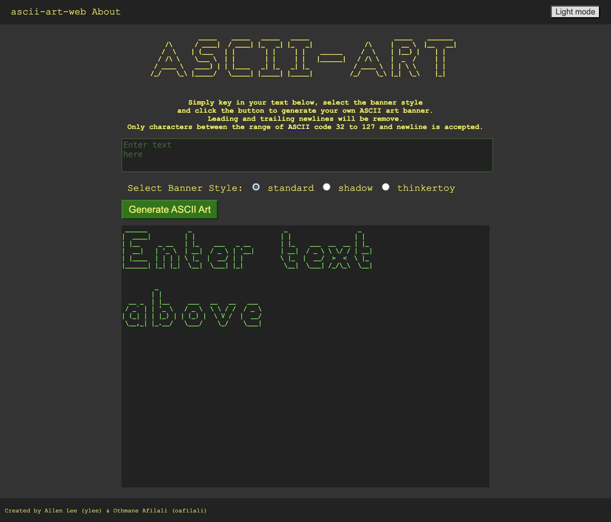
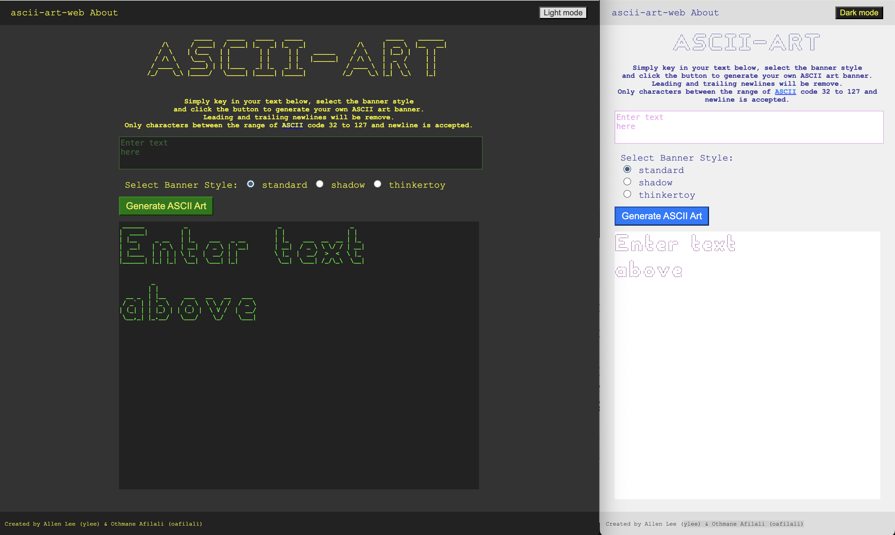

```
                      _   _                           _                                _      
                     (_) (_)                         | |                              | |     
  __ _   ___    ___   _   _   ______    __ _   _ __  | |_   ______  __      __   ___  | |__   
 / _` | / __|  / __| | | | | |______|  / _` | | '__| | __| |______| \ \ /\ / /  / _ \ | '_ \  
| (_| | \__ \ | (__  | | | |          | (_| | | |    \ |_            \ V  V /  |  __/ | |_) | 
 \__,_| |___/  \___| |_| |_|           \__,_| |_|     \__|            \_/\_/    \___| |_.__/  
                                                                                              
                                                                                              
By Allen Lee (ylee) & Othmane Afilali (oafilali)
```

# ascii-art-web
A web version of the ascii-art with simple GUI for easy usability.
The website is hosted on the local machine using port 8080.
Only `localhost:8080/` and `localhost:8080/ascii-art`are valid URL.

## Usage
Prerequisites: 
- golang version 1.22.6 
- git version 2.46.0

Download the project using `git clone https://01.gritlab.ax/git/ylee/ascii-art-web.git`. Navigate to the project folder in the terminal and start the server by entering `go run main.go`. Key in a valid URL, `localhost:8080/` or `localhost:8080/ascii-art`. And you will see the home page (refer to image below). You will see:
- a top bar with a link to the `homepage` and `about`
- an ascii art banner
- a short description on how to use the site
- a text field for user to input text
- radio buttons to select banner style
- a button to generate the ascii art. 
- result output



Simply enter the your text, select the banner style and click the button to generate the ASCII art banner.
Leading and trailing newlines will be remove (user can enter the newlines themselves).
Only ASCII characters (from 32 to 127) and newline is considered acceptable input.

Non-printable ASCII characters will result in an error.


## Implementation
Below is a flowchart that maps out how the program works.


1. In main(), `generator.GetStyles()` and `template.Must()` load the neccessary files into memory before starting the server. `about.html`, `error.html` and `index.html` is loaded into `aboutTmpl`, `errTmpl` and `indexTmpl` respectively.
2. `/static/` is defined as static server route to server static files from `/assets/static/`effectively to clients.
3. The `homeHandler()` function is registered to the pattern `/`, handling incoming requests to the root (in this situation, it is effectively handling all incoming requests other than `/static`). `/` and `/ascii-art` are considered valid URL by homeHandler().
4. `http.ListenAndServe("8080")` starts listening on local port 8080 and use the [DefaultServeMux] to handle requests.
5. The client (browser application) can send HTTP requests to the server.  If it is valid, the server will reply with a HTTP response (HTML page) and the 200 status code. Else, an error page with error status code.
5. If it is a valid `GET` request, homeHandler calls `indexTmpl.Execute()` to generate the response file (HTML).
6. The response (home page) is display by the client and the user can input the desired parameters. When the `Generate ASCII Art` button is hit, a `POST` request is sent to `/ascii-art` with the user input.
7. If it is a `POST` request, `handlePost()` is called and in it:
    - we grab the user inputs using `getFormInputs()` (http.Request.ParseForm())
    - we generate the output `with GenArt()`
    - and `indexTmpl.Execute()` generates the response with the output

Note:
- `net/http` help us starts the server, listen and handles the requests.
- `html/template` help us to generate the desired html response page without needing different html files for slight differences. We have to include some of `html/template` snytax in the html files and parse it to generate the desired result.
- When encountering an error with a HTTP request or response, `errorHandler()` is used to generate a custom error page. If the `error.html` is not found, a simple error message is display instead.

## ascii-art-stylize
This website offers two distinct visual styles for an engaging ASCII art experience:
- Retro Computer Terminal Look (Dark Mode): Designed to resonate with users who appreciate a classic, nostalgic ASCII art experience.
- Modern Bright Neutral Look (Light Mode): Aimed at users who prefer a cleaner, contemporary appearance.


A high-contrast color scheme has been implemented to guide users' focus and enhance readability. The text area, in particular, features even higher contrast to emphasize its importance and draw attention.

### Layout
The layout is simple and intuitive, with elements stacked vertically and centered on the page for ease of navigation. Key components include:
- Top Navigation Bar: Includes links to the Home and About pages. Text and cursor color changes upon hover to provide clear visual feedback.
- ASCII Art Banner: A prominent banner showcasing an example of ASCII art, serving as an inspirational and illustrative piece.
- Short Explanation Section: A concise overview of the website’s functionality to help users understand its purpose and usage.
- Interactive Textbox: The border of the top textbox changes color when clicked, reinforcing its interactive nature. The placeholder text and output preview demonstrate the site’s functionality and guide users on how to get started.
- Generate ASCII Art Button: The most visually prominent element on the page, featuring bright colors to draw the user's attention. It signals its function clearly—inviting users to click and generate ASCII art, even without reading the accompanying instructions.
- Footer: Includes the author’s name to add a personal touch and provide credit.

By combining a high-contrast color scheme, clear visual cues, and an intuitive layout, this website ensures an engaging and user-friendly experience for both retro and modern design enthusiasts.

## ascii-art-web-dockerize

A Dockerfile is provided to help generate a docker image and container. This will provide a consistent environment for the web application server to run. 

### Prerequisites
- git version 2.46.0
- Docker

### Installation
1.  Clone the project repository:
`git clone https://01.gritlab.ax/git/ylee/ascii-art-web.git`

2. Navigate to the project directory:
`Download the project using git clone https://01.gritlab.ax/git/ylee/ascii-art-web.git.`

```
ascii-art-web/
|
├── Dockerfile              # Dockerfile to build the image
├── app/                    # pkgs and assets
├── src/                    # go files to build the executable
├── build.sh                # sh script to build image and containers
├── run.sh                  # sh script to run container
└── stop.sh                 # sh script to stop and delete images/ containers/ builders
```

### Multistage build
The docker image is build in two stages: 
- Stage 1: builder
    - Base image: `golang`
    - COPY source files and build the executable
- Stage 2: runtime
    - Base image: debian:bookworm-slim
    - COPY executable and assets
    - EXPOSE port 8080
    - RUN the application
The multistage build allow us to slim down the size of the docker image. This allows for faster deployment and better storage utilization.

### Usage
There are three shell scripts, `build.sh`, `run.sh` and `stop.sh`. 
- `build.sh`: builds the image and container using the Dockerfile
- `run.sh`: runs the container and opens the page.
- `stop.sh`: stops the container and remove container and image. Prune builder if required.

Alternatively, you can run the commands yourself.
- Build the image: `docker build -t ascii-art-web-img .`
- Create the container: `docker create --name ascii-art-web -p 8080:8080 ascii-art-web-img`
    - `-p` maps the local machine port 8080 to the container's port 8080.
    - `--name` gives a name to the container
- Run the container: `docker start ascii-art-web`
- Stop the container: `docker stop ascii-art-web`

Listing images, containers and content
- Listing images: `docker images`
- Listing all containers: `docker ps -a`
- Listing contents of running container: `docker exec -it ascii-art-web ls -la`

Note: `docker container run -d -p 80:8080 --name ascii-art-web ascii-art-web-img` will create and run the container.

