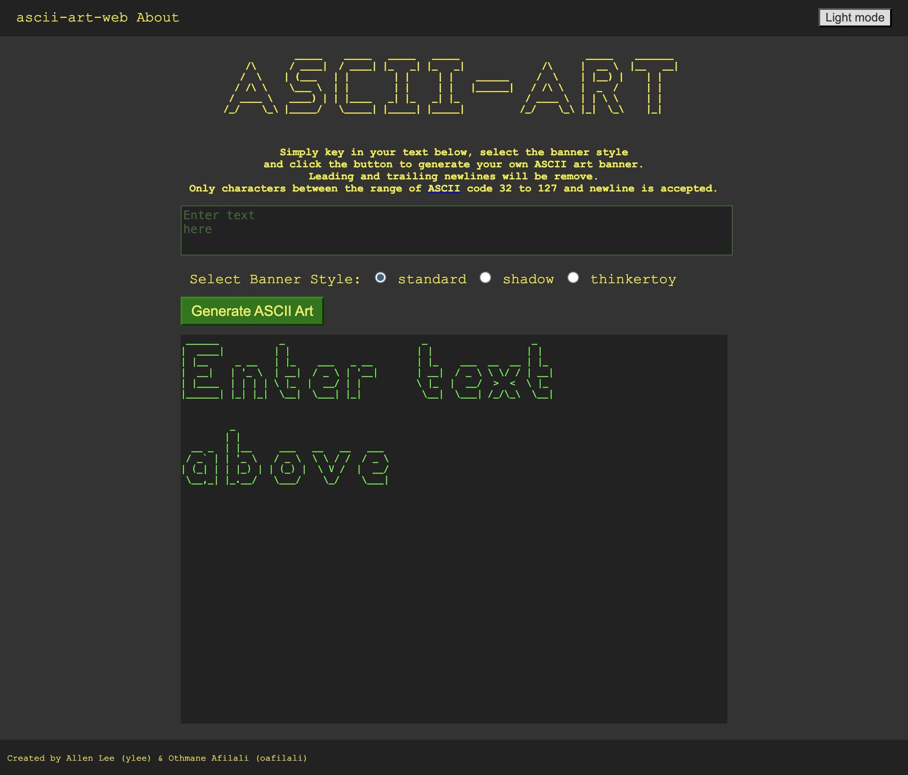
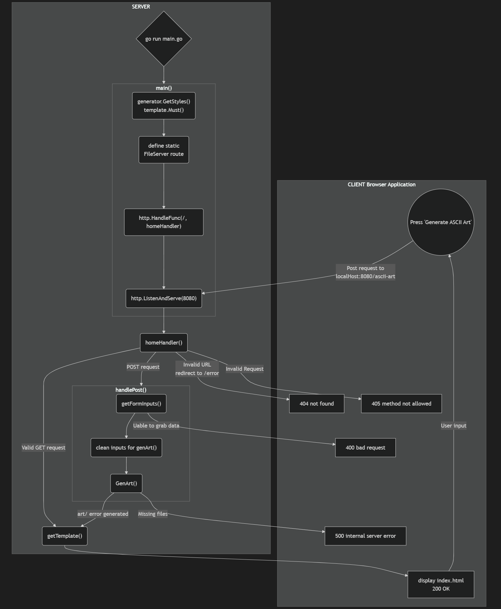
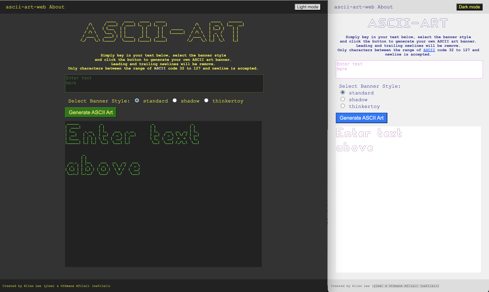

```
                      _   _                           _                                _      
                     (_) (_)                         | |                              | |     
  __ _   ___    ___   _   _   ______    __ _   _ __  | |_   ______  __      __   ___  | |__   
 / _` | / __|  / __| | | | | |______|  / _` | | '__| | __| |______| \ \ /\ / /  / _ \ | '_ \  
| (_| | \__ \ | (__  | | | |          | (_| | | |    \ |_            \ V  V /  |  __/ | |_) | 
 \__,_| |___/  \___| |_| |_|           \__,_| |_|     \__|            \_/\_/    \___| |_.__/  
                                                                                              
                                                                                              
By Allen Lee (ylee) & Othmane Afilali (oafilali)
```

# ascii-art-web
A web version of the ascii-art with simple GUI for easy usability.
The website is hosted on the local machine using port 8080.
Only `localhost:8080/` and `localhost:8080/ascii-art`are valid URL.

## Usage
Prerequisites: 
- golang version 1.22.6 
- git version 2.46.0

Download the project using `git clone https://01.gritlab.ax/git/ylee/ascii-art-web.git`. Navigate to the project folder in the terminal and start the server by entering `go run main.go`. Key in a valid URL, `localhost:8080/` or `localhost:8080/ascii-art`. And you will see the home page (refer to image below). You will see:
- a top bar with a link to the `homepage` and `about`
- an ascii art banner
- a short description on how to use the site
- a text field for user to input text
- radio buttons to select banner style
- a button to generate the ascii art. 
- result output



Simply enter the your text, select the banner style and click the button to generate the ASCII art banner.
Leading and trailing newlines will be remove (user can enter the newlines themselves).
Only ASCII characters (from 32 to 127) and newline is considered acceptable input.

Non-printable ASCII characters will result in an error.


## Implementation
Below is a flowchart that maps out how the program works.


1. In main(), `generator.GetStyles()` and `template.Must()` load the neccessary files into memory before starting the server. `about.html`, `error.html` and `index.html` is loaded into `aboutTmpl`, `errTmpl` and `indexTmpl` respectively.
2. `/static/` is defined as static server route to server static files from `/assets/static/`effectively to clients.
3. The `homeHandler()` function is registered to the pattern `/`, handling incoming requests to the root (in this situation, it is effectively handling all incoming requests other than `/static`). `/` and `/ascii-art` are considered valid URL by homeHandler().
4. `http.ListenAndServe("8080")` starts listening on local port 8080 and use the [DefaultServeMux] to handle requests.
5. The client (browser application) can send HTTP requests to the server.  If it is valid, the server will reply with a HTTP response (HTML page) and the 200 status code. Else, an error page with error status code.
5. If it is a valid `GET` request, homeHandler calls `indexTmpl.Execute()` to generate the response file (HTML).
6. The response (home page) is display by the client and the user can input the desired parameters. When the `Generate ASCII Art` button is hit, a `POST` request is sent to `/ascii-art` with the user input.
7. If it is a `POST` request, `handlePost()` is called and in it:
    - we grab the user inputs using `getFormInputs()` (http.Request.ParseForm())
    - we generate the output `with GenArt()`
    - and `indexTmpl.Execute()` generates the response with the output

Note:
- `net/http` help us starts the server, listen and handles the requests.
- `html/template` help us to generate the desired html response page without needing different html files for slight differences. We have to include some of `html/template` snytax in the html files and parse it to generate the desired result.
- When encountering an error with a HTTP request or response, `errorHandler()` is used to generate a custom error page. If the `error.html` is not found, a simple error message is display instead.

## ascii-art-stylize
There are two styles for ASCII Art web. 
- An retro computer terminal look (Dark mode) to appeal users who like ascii art.
- A modern bright neutral color scheme (Light mode) for users who are afraid of the dark.

### Color scheme
A high contrast color scheme is used to lead users' eyes and improve readability. The higher contrast in the textarea is to communicate their importance instinctively.

### Layout
The different elements of the body is stack on top of each other and centered in the page.
- The top bar consist of a home page and About page link. The color of the text and cursor changes when the mouse hovers over it to provide feedback. 
- A ASCII-ART banner is at the top of the main body as an example of what an ascii art banner is.
- Next, we have a short explaination of the functionality. 
- The top textbox border will lit up (color change) when user click in it. Here, the placeholder and result is used to show how the site works. 
- The bright coloured 'Generate ASCII Art' button is the most prominent element in the site. This communicates to the user when you click here something is going to happen (even if the user doesn't read the explaination).
- A footer with authors name.

## Future Features
- Export output
- Dockerize